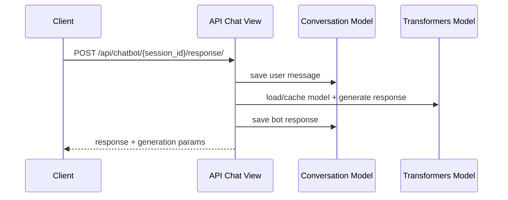
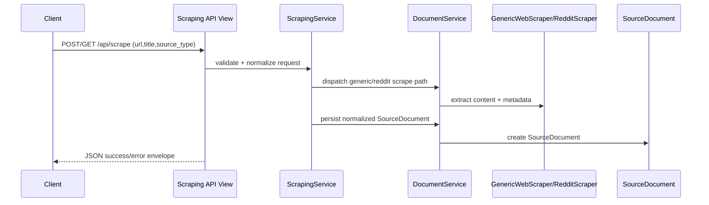
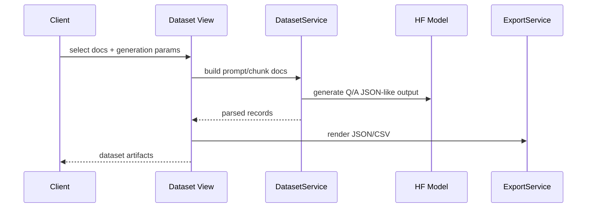
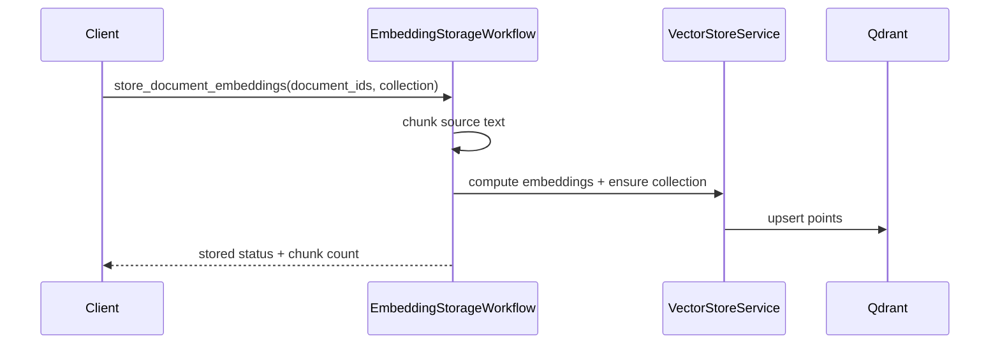
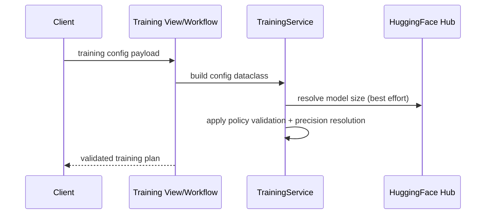
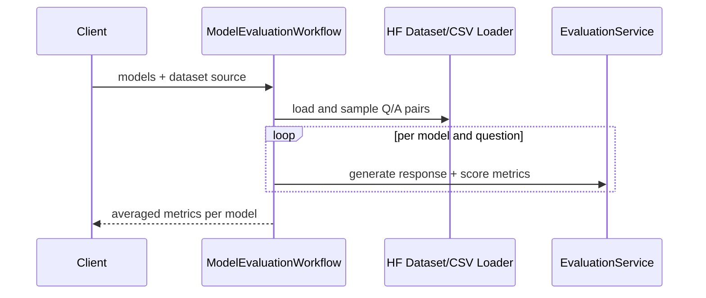

# Runtime Flows

## 1) Chat Generation Flow

Notes:
- Active endpoint logic is view-centric.
- Equivalent service abstraction exists in `ChatService`.

## 2) Scraping Vertical Slice (Service + API + Web)

Notes:
- `ScrapingService` is the application boundary for URL scraping concerns.
- API and web surfaces map the same service result into different contracts (JSON vs template context).

## 3) Dataset Generation Flow

Notes:
- Flow currently appears in both legacy-style view logic and workflow/service modules.

## 4) Embedding + Vector Storage Flow

Notes:
- Missing Qdrant dependency or connectivity returns graceful no-op/empty outcomes.

## 5) Training Preparation Flow

## 6) Evaluation Flow

Notes:
- Evaluation is compute-intensive and currently synchronous.
- A queue-backed async pathway would improve reliability.
