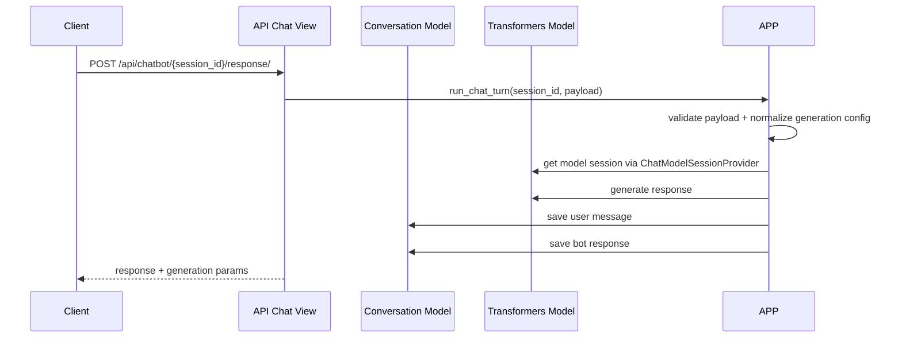
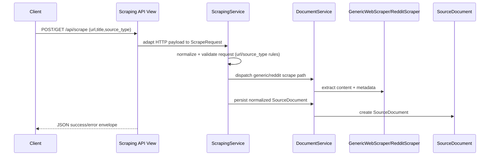
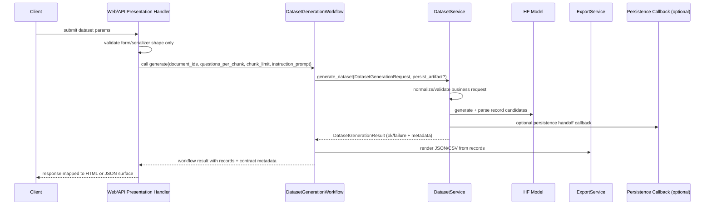
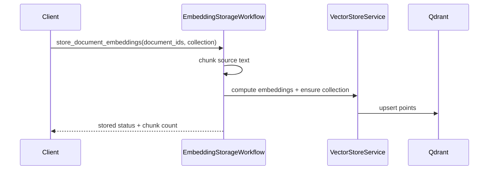
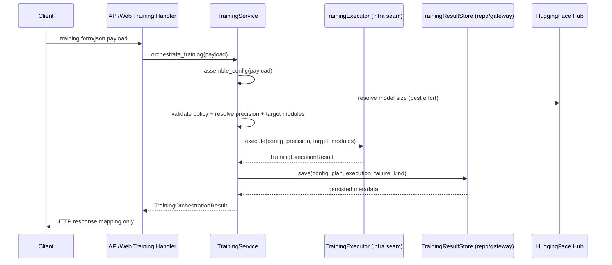
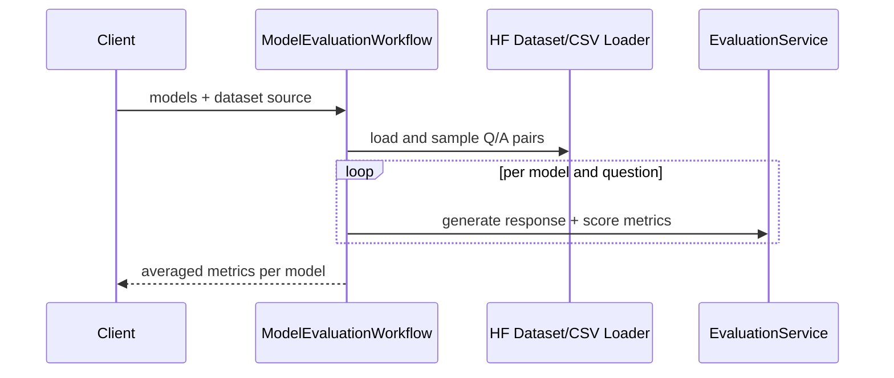

# Runtime Flows

## 1) Chat Generation Flow

Notes:
- Chat endpoint delegates validation, model/session access, generation, and persistence to `ChatService`.
- `ChatModelSessionProvider` centralizes model/tokenizer loading and per-process reuse to avoid duplicated loader paths.
- API view remains responsible for HTTP contract mapping only (e.g., `invalid_input` -> 400, unavailable session -> 503, execution failure -> 502).

## 2) Scraping Vertical Slice (Service + API + Web)

Notes:
- `ScrapingService` is the application boundary for URL scraping concerns.
- API and web surfaces map the same service result into different contracts (JSON vs template context).
- API maps `validation_error -> 400`, `upstream_error -> 502`, and `unexpected_error -> 500` without re-implementing scrape orchestration in the view.

## 3) Dataset Generation Flow

Notes:
- Forms handle request-bound validation; business orchestration remains in `DatasetService`.
- Service contracts are framework-light and reusable across API/web adapters.
- Persistence is explicit via callback handoff metadata instead of hidden view-side side effects.

## 4) Embedding + Vector Storage Flow

Notes:
- Missing Qdrant dependency or connectivity returns graceful no-op/empty outcomes.

## 5) Training Orchestration Flow

Notes:
- `TrainingService` now owns explicit lifecycle boundaries: config assembly, validation/preparation, execution handoff, and persistence handoff.
- Presentation handlers no longer coordinate runtime setup directly; they map request/response contracts.
- Execution and persistence are separate collaborators so long-running training and storage can evolve independently.

## 6) Evaluation Flow

Notes:
- Evaluation is compute-intensive and currently synchronous.
- A queue-backed async pathway would improve reliability.
